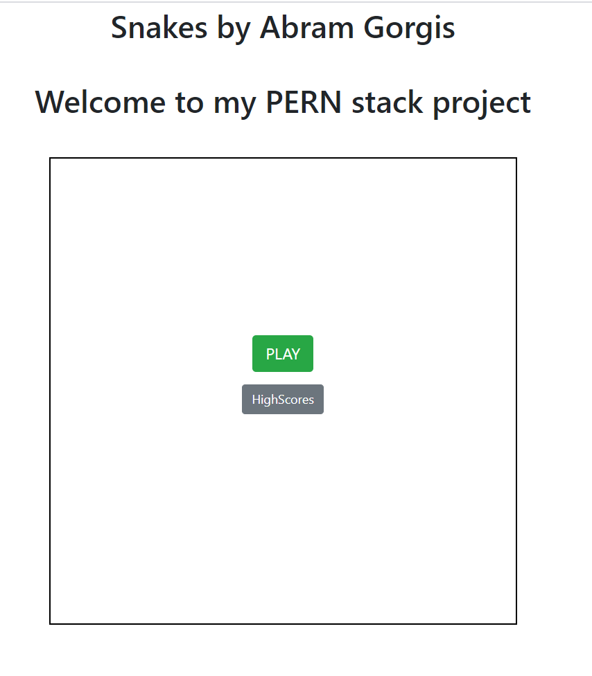
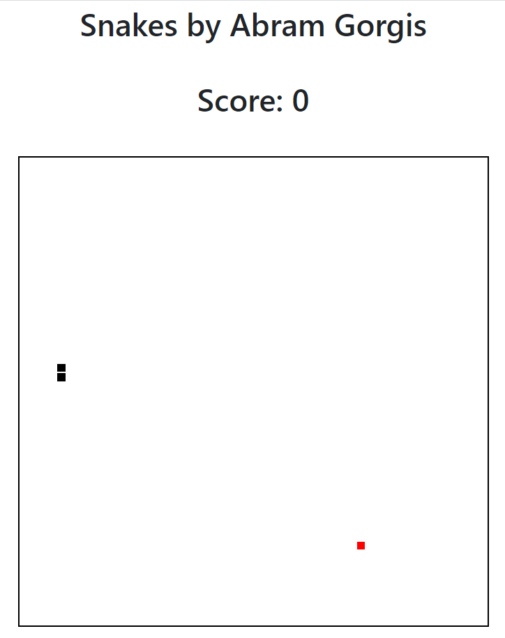
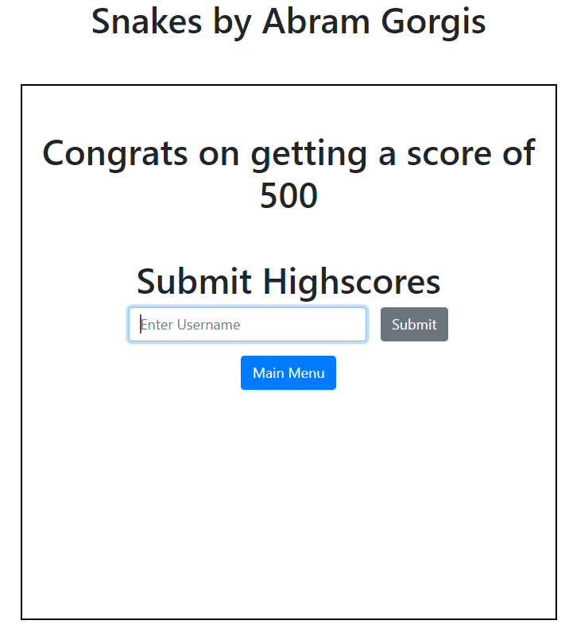
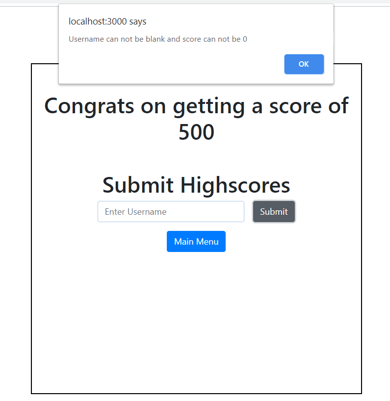

## Table of contents
* [General info](#general-info)
* [Technologies](#technologies)
* [Images](#images)

## General info
This project was created to practice developing a PERN stack application
	
## Technologies
Project is created with:
* Postgres
* Express
* Bootstrap4
* React
* Node.js
* HTML
* CSS

## Images
##### Home Page:

##### Gameplay:
* Controls are arrow keys collecting red squares will enlarge snake and increase game spead

##### Game Over:

* Entering submiting a blank name or a score of 0 will alert the user

